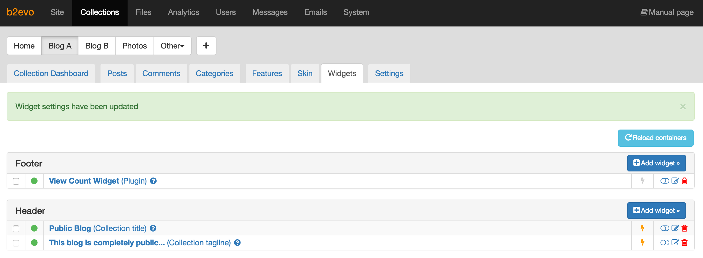
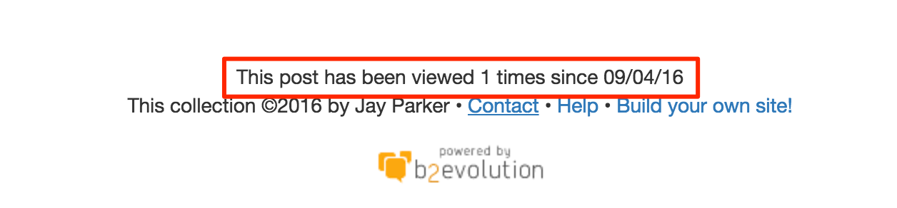

# View Count Plugin

Count all the views of each post.

This feature has been removed from the b2evolution's core some time ago, but now it's back as a plugin that you can download, install and activate on your site.

## Instructions

1. Download the .zip file.
2. Decompress it into your b2evolution's plugins folder.
3. Install it from the back-office.
4. Add the **View Count Widget** to the container where you want to display the views counter. It's recommended to add it to the **Footer** container.

5. Result

